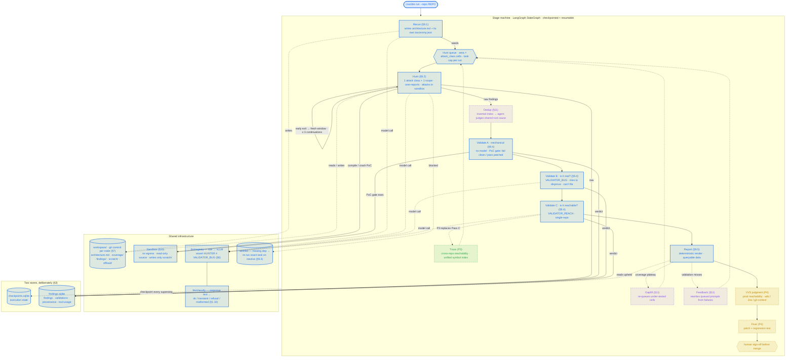

<p align="center">
  
</p>

# Crucible — Vulnerability Discovery Harness

Crucible turns a codebase into a ranked list of **reachable** security bugs — each
with a working proof-of-concept and a proposed patch — using a pipeline of
cooperating LLM agents instead of a single "point a coding agent at the repo"
session.

## Why this exists

Through 2026 a series of public writeups converged on one conclusion: for
AI-driven vulnerability research, **the orchestration around the model — not the
model itself — is what makes the results trustworthy.** Crucible is an
independent, from-scratch implementation of that idea, built to understand the
architecture hands-on and to run it on a fully open, self-hostable,
model-agnostic stack.

The three pieces of work it grew out of:

- **Cloudflare — [_why pointing a generic coding agent at a repo doesn't
  work_](https://blog.cloudflare.com/cyber-frontier-models/#why-pointing-a-generic-coding-agent-at-a-repo-doesnt-work).**
  Coding agents are tuned for one focused stream of work; vulnerability research
  is "narrow and parallel," and a single session can explore only a fraction of a
  percent of the attack surface before its context window fills. Their answer was
  a structured multi-stage pipeline — Recon → Hunt → Validate → Gapfill → Dedup →
  Trace → Report — including an adversarial validation stage run by "a different
  prompt, a different model, and no ability to generate its own findings."
  Cloudflare reports the quality gains from that discipline (for example, the
  validation-rejection rate falling from roughly 40% to 11%) came from context
  and gating, not a stronger model.
- **Anthropic — [Project Glasswing](https://www.anthropic.com/glasswing).** The
  collaborative defensive initiative behind those results, centered on the Mythos
  Preview model. Its public material is the source this project learns from, and
  it names the frontier gap directly: chaining small primitives into a working
  exploit, and proving a bug by writing, compiling, and running code that
  triggers it.
- **Visa — [Visa Vulnerability Agentic Harness
  (VVAH)](https://corporate.visa.com/en/sites/visa-perspectives/security-trust/visa-cybersecurity-mythos-project-glasswing.html).**
  An open-source reference harness built on the same lessons. It shaped Crucible's
  Recon design — a staged, deterministic-first map of the codebase — and its
  central point: "progress in software security is no longer limited by how
  quickly vulnerabilities can be found, but by how quickly they can be verified,
  disclosed, and patched," with human oversight kept "at every key point in the
  workflow."

Crucible is a learning-and-research build, not a product. It uses **LangGraph**
for a durable, checkpointed stage machine and **LangChain** agents for each
stage, and routes every agent role to a model of your choice — local Ollama,
DeepSeek, or anything on OpenRouter. The full design rationale is in
[`specs.md`](specs.md); [`architecture.md`](architecture.md) documents every
component.

## Status

Implemented and real-run verified: the **Recon → Hunt → Validate → Report**
skeleton on a database with a separate validator that cannot file its own
findings, plus the **producer–consumer loop** — Dedup, Gapfill, Feedback, and the
loop wiring. The structure, state types, deterministic gates, model routing,
schema, and instrumentation are real; `recon` and `hunt` are real two-phase
agents.

Still `NotImplementedError` stubs: `validate_bug`, `validate_reachability`,
`report`, and the sandbox PoC-gate execution path — so a run currently drains the
loop and then stops cleanly at `validate_bug` (exit 3). Cross-repo reachability
tracing and an automated, human-gated Fixer are designed but unbuilt.

## Architecture

Two layers. The **stage machine** (LangGraph `StateGraph`) is coarse, durable, and
checkpointed — it survives a crash and resumes. Each **agent stage** is a
`create_agent` + middleware stack (LangChain) that reads and writes the `workspace/`
filesystem — large artifacts never travel through model context or the DB (§1.1).

The diagram is the **whole harness across all four build phases**. Solid blue is
**Phase 1**: Recon → Hunt → Validate → Report. **Phase 2** (§11, issues #19–#22)
is now built: <span title="Phase 2">Gapfill · Dedup · Feedback · loop_control</span>
turn the pipeline into a bounded **producer–consumer loop** — a bug found late in
a cycle is still deduped and validated in the same run. Still dashed / built-later:
cross-repo Trace (§3 P3), VVS judgment + human-gated Fixer (§2 P4).



**Legend** — <span>■</span> blue solid = Phase 1 (built) · purple dashed = Phase 2
(Gapfill / Dedup / Feedback) · green dashed = Phase 3 (cross-repo Trace) · amber
dashed = Phase 4 (VVS + Fixer). Solid arrows = the request path; dotted arrows =
side effects (filesystem, stores, model calls, queue feedback).

## Layout

| Path | Spec | Status |
|---|---|---|
| `crucible/graph/build.py` | §4 topology + checkpointer + §11 producer–consumer loop | wired |
| `crucible/graph/state.py` | §5 `CrucibleState` (pointers/counters only) | done |
| `crucible/graph/hooks.py` | §7 offload/compaction, §8 continuation gate, §11 loop gate | gates done, offload stub |
| `crucible/graph/nodes/recon.py` | §9.1 + issues #5, #34 | **re-engineered (#34): R0 seed → R1a orient (lead agent → ModuleMap) → R1b subsystem maps (parallel) → R1c synthesis → R2 → R3 (boundary-aware); `recon_quality ∈ {full,partial,seed_only}`** |
| `crucible/recon/` | issues #5, #34 — `seed.py` (R0), `orient.py` (R1a partitioner), `synthesize.py` (R1c), `decompose.py` (R3 + 11-section `architecture.md`), `schema.py` | done (R1a/R1c/R3 deterministic) |
| `crucible/graph/nodes/hunt.py` | §9.2 | wired — two-phase Hunter agent per cell (explore + forced `HuntResult` emit), per-task Docker sandbox exec, tautology deny-list at parse time, findings persisted with provenance, `coverage/<area>.md`; prompt-tuning for over-reporting owed (#3) |
| `crucible/graph/nodes/validate_mechanical.py` | §9.4 Pass A | wired → `validation/mechanical.py`; loads finding from store, verdict persisted (funnel + Feedback signal) |
| `crucible/graph/nodes/dedup.py` | §11 Dedup (issue #20) | **done — inverted-index shortlist + `VALIDATOR_BUG` judge; cross-run `stable_key` fold** |
| `crucible/graph/nodes/gapfill.py` | §11 Gapfill (issue #19) | **done — deterministic re-queue of under-tested `area × attack_class` cells** |
| `crucible/graph/nodes/feedback.py` | §11 Feedback (issue #21) | **done — rewrites queued prompts from validation failures / shallow / repeated miss** |
| `crucible/graph/nodes/loop_control.py` | §11 loop wiring (issue #22) | **done — bounded producer–consumer cycles (`CRUCIBLE_MAX_CYCLES`, default 2)** |
| `crucible/coverage.py` | §11/§12 `(area × attack_class)` coverage bookkeeping | done (deterministic) |
| `crucible/graph/nodes/validate_bug.py` | §9.4 Pass B | stub |
| `crucible/graph/nodes/validate_reachability.py` | §9.4 Pass C | stub |
| `crucible/graph/nodes/report.py` | §9.5 deterministic render | stub |
| `crucible/llm/registry.py` | §6 role→endpoint, `HUNTER != VALIDATOR_BUG` assert | done |
| `crucible/llm/classify.py` | §6 / §1.10 response classification | done |
| `crucible/validation/schema.py` | §9.2 `Finding` (field order load-bearing) + tautology deny-list | done |
| `crucible/validation/mechanical.py` | §9.4 deterministic gates + PoC gate | gates done, PoC gate stub (fail-closed) |
| `crucible/workspace/` | §7 layout + git-per-node | done |
| `crucible/agents/tools.py` | §9.2 tools + universal offload wrapper | offload done, tools stub |
| `crucible/agents/instrumentation.py` | §1.12 per-tool counters | done |
| `crucible/sandbox/__init__.py` | §10 provider adapter protocol + policy | done |
| `crucible/sandbox/docker.py` | §10 Docker dev backend (`DockerSandboxProvider`) | wired + smoke-tested (create/exec/destroy, ro source mount, `--network none`); escape-test suite (§14.7) still owed |
| `crucible/store/` | §3 SQLite domain store (findings/validations/wishlist/tool-usage) | done |
| `crucible/skills/` | §7 prompt files with `version:` front-matter | 28 attack-class methodologies (full builtin taxonomy, issue #16) + 2 validators + 4 recon (`orient`/`map`/`threatmodel`/`decompose`); fixture tuning owed (#3) |
| `tests/fixtures/repos/` | §12 golden fixtures + `bugs.yaml` manifests | fixture-c / -py / -clean / -holdout seeded |

## Two stores, deliberately (§3)

LangGraph `SqliteSaver` holds **execution** state (`checkpoints.sqlite`).
`crucible/store/` holds **domain** state (`findings.sqlite`) — findings must
outlive and be queryable independently of any run.

## Install, build, use

### Prerequisites
- Python ≥ 3.11
- **Docker** running (the sandbox backend; skip with `--no-sandbox`). The
  invoking user must reach the daemon without `sudo` — add it to the `docker`
  group (`sudo usermod -aG docker "$USER"`, then re-login), or prefix commands
  with `sg docker -c '…'` for the current session. First run pulls
  `python:3.12-slim-bookworm`.
- An LLM provider — local **Ollama** (default) or **DeepSeek** (hosted)

### Install (development)

```bash
python -m venv .venv && source .venv/bin/activate
pip install -e ".[dev]"          # editable install + pytest/ruff
crucible --help
```

### Models

Provider-configurable via `crucible/llm/registry.py`. Wired providers: `ollama`
(local, default), `deepseek` (hosted, OpenAI-compatible) and `openrouter` (one
key, any hosted model — the model matrix). Defaults use Ollama with **different
lineages** for hunter vs validator (the §6 assertion):

```bash
ollama serve
ollama pull qwen2.5-coder:7b     # recon + hunter
ollama pull llama3.1:8b          # validators
```

Override per role, highest precedence last: `crucible/config.py` defaults →
`crucible.toml` → `config.yaml` → env vars.

**`config.yaml`** (recommended — `cp config.yaml.example config.yaml`, gitignored)
carries the whole model matrix plus tracing toggles. Non-secret only; API keys
stay in `.env`.

```yaml
# config.yaml — one model per role, all on OpenRouter
models:
  recon:          { provider: openrouter, model: qwen/qwen-2.5-coder-32b-instruct }
  hunter:         { provider: openrouter, model: anthropic/claude-sonnet-4 }
  validator_bug:  { provider: openrouter, model: openai/gpt-4o }          # != hunter (§6)
  validator_reach:{ provider: openrouter, model: google/gemini-2.0-flash }
tracing:
  langsmith: { enabled: true, project: crucible }   # LANGSMITH_API_KEY from .env
```

A role routed to `openrouter` MUST name its `model` — there is no silent default.
`crucible.toml` (`[models.hunter] provider = "..."`) still works; `config.yaml`
wins where both set the same value.

```bash
# every value is also settable by env, which overrides the file.
export RECON_LLM=openrouter                  # ollama | deepseek | openrouter | openai (openai reserved)
export CRUCIBLE_MODEL_RECON=qwen/qwen-2.5-coder-32b-instruct
```

Secrets: `cp .env.example .env` and fill it in. `.env` is at the repo root
(gitignored; loaded automatically by `crucible run` / `status`) —
`OPENROUTER_API_KEY=sk-or-...`, `DEEPSEEK_API_KEY=sk-...`, `LANGSMITH_API_KEY=...`.

### Run

```bash
crucible run --repo <path-to-target-checkout>
```

| Flag | Default | Meaning |
|---|---|---|
| `--repo` | *(required)* | read-only checkout to audit |
| `--workspace` | `.crucible-workspace` | agent-writable, git-initialised working tree |
| `--checkpoint-db` | `checkpoints.sqlite` | LangGraph execution state (resume) |
| `--store-url` | `sqlite:///findings.sqlite` | domain store (findings, validations, tool usage) |
| `--config` | auto (`config.yaml` / `crucible.toml`) | model + tracing config file (format by suffix) |
| `--resume <run_id>` | — | continue a run from its last checkpoint |
| `--stop-after <stage>` | — | stop cleanly after the named stage (`recon`, `hunt`, `dedup`, …) completes; resume with `--resume <run_id>` |
| `--no-sandbox` | off | skip the Docker boot check (nodes needing exec will fail) |

| Env | Default | Meaning |
|---|---|---|
| `CRUCIBLE_MAX_CYCLES` | `2` | Phase 2 producer–consumer loop bound (§11) |
| `CRUCIBLE_GAPFILL_MAX_REQUEUE` | `8` | cells Gapfill re-queues per cycle |
| `CRUCIBLE_FEEDBACK_MAX_REWRITES` | `6` | queued prompts Feedback rewrites per cycle |

Status: Recon and Hunt are implemented; the Phase 2 loop (Dedup → validate A →
Gapfill → Feedback → `loop_control`) runs continuously, bounded by
`CRUCIBLE_MAX_CYCLES`. Validate (bug/reach) and Report are still stubs, so a run
drains the loop and then exits at `stopped at stub node: validate_bug` (code 3),
having written `coverage/`, `dedup/clusters.json`, any `findings/`, and
checkpoints. Hunt needs a reachable Hunter model — set `HUNTER_LLM=deepseek` (or
pull the Ollama default) alongside `RECON_LLM`.

### Logs & tracing

Every run logs to the console and to `<workspace>/run.log` (DEBUG) — per-node
entry/exit + durations, Recon phase counts, and every `recon/errors.jsonl` line.
`CRUCIBLE_LOG_LEVEL=DEBUG` for more on the console.

Distributed tracing is opt-in — three modes, chosen by env (`crucible/obs.py`):

**LangSmith** (internal-dev path, specs §13) — full agent traces: every model
call, tool call, and middleware span, grouped by `run_id`.

```bash
export LANGSMITH_TRACING=true
export LANGSMITH_API_KEY=lsv2_...
export LANGSMITH_PROJECT=crucible          # defaulted if unset
crucible run --repo <path>
```

**Local OTLP only** (data-residency path) — spans go **only** to your collector
(Jaeger / Tempo / SigNoz / OpenObserve / Langfuse), never LangChain's cloud
(`LANGSMITH_OTEL_ONLY=true` is forced):

```bash
pip install "crucible[otel]"
export CRUCIBLE_OTEL=1
export OTEL_EXPORTER_OTLP_ENDPOINT=http://localhost:4318
```

Set both to fan out to LangSmith *and* a collector. Put these in `.env`
(gitignored, auto-loaded). Tracing off if neither is configured.

```bash
# smoke test the whole substrate against a fixture
crucible run --repo tests/fixtures/repos/fixture-py --no-sandbox
crucible status <run_id>          # fork rate + per-(role,tool) invocation counts (§14.10)
```

### Build a distributable

```bash
pip install build
python -m build                  # -> dist/crucible-<v>-py3-none-any.whl + .tar.gz
pipx install dist/crucible-*.whl # or: pip install dist/crucible-*.whl
```

### Tests

```bash
pytest                           # deterministic units, no network / no Docker
pytest tests/test_cli.py -v      # CLI smoke: help, status, run-to-stub
pytest tests/api -q              # HTTP API contract suite
```

## HTTP API

A read-first HTTP API over everything a run produces — the domain store
(`findings.sqlite`), the LangGraph execution state (`checkpoints.sqlite`), and
the git-per-node workspace tree. It makes no outbound network calls.

```bash
pip install -e ".[api]"
crucible serve                   # 127.0.0.1:8787 — docs at /docs, schema at /openapi.json
```

| Endpoint | Returns |
|---|---|
| `GET /runs` · `GET /runs/{id}` | run list / detail + funnel counts |
| `GET /runs/{id}/report` · `/report.md` | the deterministic report (JSON / Markdown) |
| `GET /runs/{id}/metrics` | funnel counts, fork rate, per-tool usage |
| `GET /runs/{id}/coverage` | `(area × attack_class)` matrix + gapfill buckets |
| `GET /runs/{id}/findings` | filter `status` / `severity` / `attack_class`, paginated |
| `GET /findings/{id}` · `/validations` | full finding + provenance + per-pass verdict trail |
| `GET /findings?stable_key=…` | cross-run history for one structural key |
| `GET /runs/{id}/state` | execution state — `pending_hunts`, `cycle_count`, `recon_quality`, next node |
| `GET /runs/{id}/artifacts[/{path}]` | index + raw workspace file (traversal-guarded) |
| `GET /runs/{id}/architecture` · `/recon/{seed,module-map,threat-model,attack-surface,task-manifest}` · `/dedup/clusters` · `/log` | typed artifact shortcuts |
| `GET /runs/{id}/wishes` · `GET /wishes` · `POST /wishes/{id}/resolve` | blocked-task wishlist (§9.3) |

Auth is off on a loopback bind. Set `CRUCIBLE_API_TOKEN` (and optionally
`CRUCIBLE_API_TOKEN_READONLY`) to require a bearer token; binding a non-loopback
address without one is refused unless `--no-auth` is passed.

Full reference — endpoints, auth, reverse-proxy setup, `curl` recipes:
[`docs/api.md`](docs/api.md). Tracking: the
[`API` milestone](https://github.com/mbenachour/crucible/milestone/6).

### Dashboard

A read-first web UI ([`ui/`](ui/)) — browse runs, drill into findings (threat
model, PoC, patch diff, validation trail), read the report and recon artifacts,
view the coverage matrix, watch execution state, work the wishlist.

```bash
npm --prefix ui install
npm --prefix ui run build        # -> ui/dist
crucible serve                   # serves the dashboard at / alongside the API
```

`crucible serve` auto-detects `ui/dist` (override with `CRUCIBLE_API_UI_DIR`,
disable with `--no-ui`). Dev loop: `crucible serve` + `npm --prefix ui run dev`
(Vite on :5173, proxying the API). Tracking: the
[`UI` milestone](https://github.com/mbenachour/crucible/milestone/7).

## What Phase 1 "done" needs (specs.md §14)

1. `crucible run --repo .../fixture-py` completes and emits a report
2. kill mid-run, resume, lose no completed work
3. hunter ≠ bug-validator model; startup fails if identical ✅ (`test_registry.py`)
4. bug-detection and reachability are separate model calls ✅ (topology)
5. every upheld finding: populated threat model + PoC (fails clean / passes patched) + provenance
6. `fixture-clean` yields zero upheld findings
7. sandbox escape-test suite passes
8. tool outputs over threshold offloaded to disk ✅ (`test_offload.py`)
9. continuation cap enforced and observable ✅ (`test_continuation_cap.py`)
10. fork rate + per-tool counts in `crucible status`
11. prompt changes regression-tested against `fixture-holdout`

## Not in this draft (Phase 0 and Phase 3+)

Phase 0's single-session `security-audit` skill (§2); cross-repo Trace, VVS, and
the human-gated Fixer (§15). Phase 2 (Gapfill / Dedup / Feedback / loop wiring,
§11) **is** built — issues #19–#22.

## License

[MIT](LICENSE).
